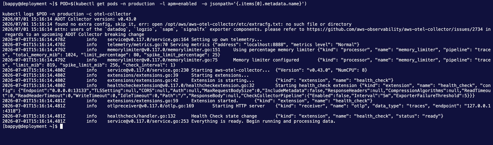
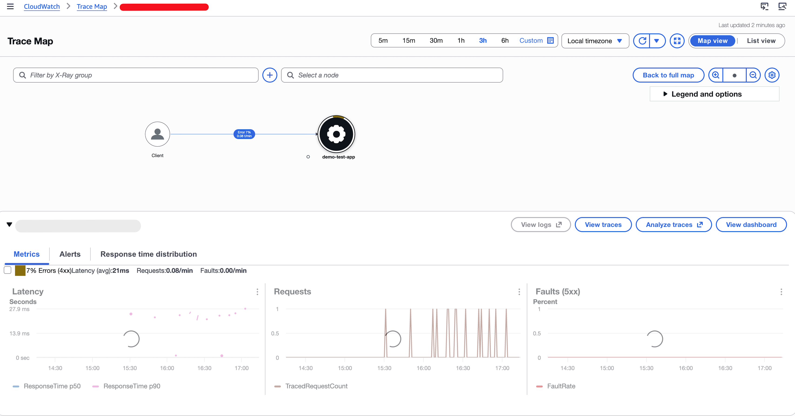

# Distributed Tracing for PHP on EKS Fargate with AWS X-Ray

> How I instrumented a PHP 8.4 microservice running on **EKS Fargate** with **OpenTelemetry** and shipped traces to **AWS X-Ray** — using the ADOT Collector as a **native sidecar**, because on Fargate you cannot run a DaemonSet.

**Repo:** all manifests, Dockerfile, and configs referenced here are in this repository. Every secret has been replaced with `xxxxxxxx` — swap in your own values.

---

## 1. The problem

We run a PHP (Slim) microservice on **Amazon EKS with Fargate**, deployed via **FluxCD**. Application logs already flow to Elasticsearch. What we were missing was **distributed tracing** — the ability to see a single request's journey, where latency accumulates, and which downstream call is slow.

We wanted to stay cloud-native and use **AWS X-Ray**, since we're already all-in on AWS.

And that's where the documentation ran out.

**Almost every AWS/ADOT tracing guide assumes you run the OpenTelemetry Collector as a DaemonSet.** On Fargate, there is no node you own — **DaemonSets do not run on Fargate at all**. Pods *are* the compute unit. So the standard "deploy the ADOT DaemonSet and point your app at the host IP" instructions are simply not applicable.

On top of that, PHP is a second-class citizen in most OTel examples — the ecosystem writes its guides for Java, Go, and Node.

So the pattern had to be:

> **One collector per pod, running alongside the app container, sharing the pod network namespace.**

That is what this post documents.

---

## 2. Architecture

| Layer | Component | Role |
|---|---|---|
| **1 — App** | PHP 8.4 + Slim + OTel SDK (auto-instrumentation) | Generates spans for incoming HTTP requests automatically via `opentelemetry-auto-slim`. Exports OTLP/HTTP to `localhost:4318`. |
| **2 — Collector** | ADOT Collector (native sidecar in the same pod) | Receives OTLP/HTTP spans on `127.0.0.1:4318`, batches them, exports to X-Ray via the `awsxray` exporter. |
| **3 — Backend** | AWS X-Ray (`ap-southeast-1`) | Stores, indexes, and visualises traces. Service maps and latency analysis in the AWS Console. |

```
┌──────────────────────── Pod (Fargate) ─────────────────────────┐
│                                                                │
│  ┌──────────────┐   ┌──────────────┐   ┌────────────────────┐  │
│  │    nginx     │──▶│  php-fpm     │──▶│  ADOT Collector    │  │
│  │   :80        │   │  :9000       │   │  :4318 (OTLP/HTTP) │  │
│  │              │   │  + otel ext  │   │  :13133 (health)   │  │
│  └──────────────┘   └──────────────┘   └─────────┬──────────┘  │
│         shared network namespace = localhost     │             │
└──────────────────────────────────────────────────┼─────────────┘
                                                   │ IRSA creds
                                                   ▼
                                            AWS X-Ray (ap-southeast-1)
```

**Why `localhost` works:** all containers in a Kubernetes pod share one network namespace. The PHP container's `127.0.0.1:4318` *is* the collector's listening socket. No service, no DNS, no network hop.

---

## 3. Step 1 — Add the OpenTelemetry extension to the PHP image

PHP needs a **C extension** (`opentelemetry.so`) for auto-instrumentation to hook into function calls. The easiest way to install it in a Docker image is `mlocati/php-extension-installer`, which handles the PECL build *and* auto-enables the extension:

```dockerfile
# syntax=docker/dockerfile:1
FROM php:8.4-fpm

ENV COMPOSER_ALLOW_SUPERUSER=1

RUN apt-get update && apt-get install -y --no-install-recommends \
    libpq-dev libicu-dev libzip-dev \
    && rm -rf /var/lib/apt/lists/*

RUN docker-php-ext-install -j$(nproc) pdo pdo_pgsql bcmath intl zip

RUN pecl install redis && docker-php-ext-enable redis && rm -rf /tmp/pear

# ---- OpenTelemetry PHP extension ----
COPY --from=mlocati/php-extension-installer /usr/bin/install-php-extensions /usr/local/bin/
RUN install-php-extensions opentelemetry
# -------------------------------------

COPY --from=composer:latest /usr/bin/composer /usr/bin/composer

RUN mkdir /test
COPY ./test/ /test
RUN cd /test && composer install

WORKDIR /app_dir
```

### ⚠️ Gotcha: the extension must actually be enabled

`install-php-extensions` writes a `docker-php-ext-opentelemetry.ini` into `/usr/local/etc/php/conf.d/` for you. **But if you `COPY` your own `php.ini` over the default, make sure it doesn't suppress that** — and if you install via plain `pecl` instead, you must add the line yourself:

```ini
extension=opentelemetry
```

Verify inside the built image before you ever deploy:

```bash
docker run --rm <your-image> php -m | grep -i opentelemetry
# opentelemetry

docker run --rm <your-image> php --ri opentelemetry
```

If that returns nothing, **nothing downstream will work** — no spans will ever be produced, and you'll waste hours debugging the collector.

### Composer packages

The extension is the hook; the SDK is what builds and exports spans. In the app's `composer.json`:

```bash
composer require \
  open-telemetry/sdk \
  open-telemetry/exporter-otlp \
  open-telemetry/opentelemetry-auto-slim
```

Swap `opentelemetry-auto-slim` for `opentelemetry-auto-laravel`, `-symfony`, etc. depending on your framework. The `auto-*` packages are what give you **zero-code instrumentation** — you do not add a single OTel line to your application code.

Then build and push:

```bash
docker build -t <ACCOUNT_ID>.dkr.ecr.ap-southeast-1.amazonaws.com/demo-test-microservice-prod:<TAG> .
docker push <ACCOUNT_ID>.dkr.ecr.ap-southeast-1.amazonaws.com/demo-test-microservice-prod:<TAG>
```

...and update the image tag in the deployment manifest. With FluxCD, commit the manifest change and Flux reconciles it.

---

## 4. Step 2 — IAM permissions via IRSA

The pod needs AWS credentials to write to X-Ray. On EKS Fargate this is done with **IRSA** (IAM Roles for Service Accounts) — the Kubernetes ServiceAccount is annotated with an IAM role ARN, and the AWS SDK inside the collector picks up the credentials automatically via the projected web-identity token.

**IAM policy on the role:**

```json
{
  "Version": "2012-10-17",
  "Statement": [{
    "Effect": "Allow",
    "Action": [
      "xray:PutTraceSegments",
      "xray:PutTelemetryRecords",
      "xray:GetSamplingRules",
      "xray:GetSamplingTargets"
    ],
    "Resource": "*"
  }]
}
```

> `GetSamplingRules` / `GetSamplingTargets` are only needed if you use **X-Ray centralised (remote) sampling**. We sample in the SDK (`parentbased_traceidratio`), so they're optional — but harmless to keep if you may switch later.

**ServiceAccount:**

```yaml
apiVersion: v1
kind: ServiceAccount
metadata:
  name: demo-application
  namespace: production
  annotations:
    eks.amazonaws.com/role-arn: arn:aws:iam::xxxxxxxx:role/xxxxxxxx
```

The trust policy on that role must trust your cluster's OIDC provider and be scoped to `system:serviceaccount:production:demo-application`.

The deployment then references it:

```yaml
spec:
  template:
    spec:
      serviceAccountName: demo-application
```

If you skip this, the collector starts fine and then quietly fails on export with `AccessDeniedException` — check the collector logs.

---

## 5. Step 3 — The ADOT Collector ConfigMap

The collector is configured entirely through a ConfigMap:

```yaml
apiVersion: v1
kind: ConfigMap
metadata:
  name: demo-test-otel-config-production
  namespace: production
data:
  otel-config.yaml: |
    extensions:
      health_check:
        endpoint: 0.0.0.0:13133
    receivers:
      otlp:
        protocols:
          http:
            endpoint: 127.0.0.1:4318   # loopback only — same pod netns
    processors:
      memory_limiter:
        check_interval: 1s
        limit_percentage: 80
        spike_limit_percentage: 25
      batch:
        timeout: 5s
        send_batch_size: 256
    exporters:
      awsxray:
        region: ap-southeast-1
    service:
      extensions: [health_check]
      pipelines:
        traces:
          receivers: [otlp]
          processors: [memory_limiter, batch]
          exporters: [awsxray]
      telemetry:
        logs:
          level: info
```

| Config key | Rationale |
|---|---|
| `endpoint: 127.0.0.1:4318` | Bind to loopback only. The app and collector share the pod network namespace — no external exposure needed, no reason to listen on `0.0.0.0`. |
| `memory_limiter` | Stops the collector exhausting pod memory under a trace burst. 80% limit, 25% spike headroom. |
| `batch` (5s / 256) | Groups spans before export — fewer X-Ray API calls, better throughput. |
| `awsxray.region` | Must match the cluster region. The exporter picks up the IRSA role automatically. |
| `health_check` on `:13133` | Backs the liveness probe on the sidecar. |

---

## 6. Step 4 — Run the collector as a native sidecar

**This is the key Fargate-specific move.**

A DaemonSet is not an option. The collector has to live *inside* the pod. But a plain extra entry under `containers:` has two problems: startup ordering isn't guaranteed (the app may boot and try to export before the collector is listening), and there's no clean lifecycle relationship.

Kubernetes **1.29+ native sidecars** solve this: an **`initContainer` with `restartPolicy: Always`**.

```yaml
spec:
  serviceAccountName: demo-application
  terminationGracePeriodSeconds: 60

  initContainers:
    - name: otel-collector
      image: public.ecr.aws/aws-observability/aws-otel-collector:v0.43.0
      restartPolicy: Always          # <-- makes this a NATIVE SIDECAR
      args: ["--config=/etc/otel/otel-config.yaml"]
      volumeMounts:
        - name: otel-config
          mountPath: /etc/otel
      livenessProbe:
        httpGet:
          path: /
          port: 13133
        initialDelaySeconds: 10
        periodSeconds: 30
      resources:
        requests:
          cpu: "200m"
          memory: "256Mi"
        limits:
          cpu: "200m"
          memory: "256Mi"
```

What `restartPolicy: Always` on an initContainer buys you:

- **It starts before the app containers, and the app containers don't start until it's ready.** No dropped spans at boot.
- **It keeps running for the pod's whole lifetime** — it doesn't "complete" like a normal init container.
- **It's restarted independently if it crashes**, without restarting the app.
- **It's terminated after the app containers on shutdown** — so in-flight spans still have somewhere to go during the drain.

### 💸 Fargate cost note

On Fargate you pay for the **sum of all container requests**, rounded up to the next Fargate task size. A fat collector sidecar directly costs you money on every single pod.

Our original config requested **1000m CPU / 1024Mi** for the collector — the same as a real application container. That's massively oversized for a batching trace forwarder. **200m / 256Mi is a far more realistic starting point**; watch the collector's own memory metrics and tune from there.

---

## 7. Step 5 — Point the PHP app at the sidecar

All OTel PHP configuration is via environment variables — nothing in application code:

```yaml
env:
  - name: MY_POD_NAME
    valueFrom:
      fieldRef:
        fieldPath: metadata.name
  - name: MY_POD_NAMESPACE
    valueFrom:
      fieldRef:
        fieldPath: metadata.namespace

  - name: OTEL_PHP_AUTOLOAD_ENABLED
    value: "true"
  - name: OTEL_SERVICE_NAME
    value: "demo-test"
  - name: OTEL_TRACES_EXPORTER
    value: "otlp"
  - name: OTEL_METRICS_EXPORTER
    value: "none"
  - name: OTEL_LOGS_EXPORTER
    value: "none"
  - name: OTEL_EXPORTER_OTLP_PROTOCOL
    value: "http/protobuf"
  - name: OTEL_EXPORTER_OTLP_ENDPOINT
    value: "http://localhost:4318"
  - name: OTEL_EXPORTER_OTLP_TIMEOUT
    value: "200"
  - name: OTEL_PROPAGATORS
    value: "xray,tracecontext,baggage"
  - name: OTEL_TRACES_SAMPLER
    value: "parentbased_traceidratio"
  - name: OTEL_TRACES_SAMPLER_ARG
    value: "0.1"
  - name: OTEL_RESOURCE_ATTRIBUTES
    value: "deployment.environment=production,k8s.pod.name=$(MY_POD_NAME),k8s.namespace.name=$(MY_POD_NAMESPACE)"
```

The ones that matter most:

- **`OTEL_PHP_AUTOLOAD_ENABLED=true`** — without this, the `auto-*` Composer packages never register their hooks. Spans will never be created.
- **`OTEL_EXPORTER_OTLP_ENDPOINT=http://localhost:4318`** — the sidecar. Shared network namespace makes this work.
- **`OTEL_PROPAGATORS=xray,tracecontext,baggage`** — `xray` is essential if requests arrive through an ALB or from another X-Ray-instrumented service carrying `X-Amzn-Trace-Id`. Without it, traces fragment instead of stitching into one.
- **`OTEL_METRICS_EXPORTER=none` / `OTEL_LOGS_EXPORTER=none`** — we only want traces. Logs already go to Elasticsearch; metrics aren't in scope. Leaving these on would send data to a pipeline the collector doesn't even define.
- **`OTEL_TRACES_SAMPLER_ARG=0.1`** — **we sample 10% of traces.** If you hit an endpoint once and see nothing in X-Ray, this is usually why. Set it to `1.0` temporarily while you're validating the setup, then dial it back down for cost.
- **`OTEL_EXPORTER_OTLP_TIMEOUT=200`** — 200ms. The export is a loopback call; if it can't complete near-instantly, something is wrong and we'd rather drop the span than add latency to a user request.
- **`OTEL_RESOURCE_ATTRIBUTES`** — injects pod name and namespace onto every span using the Downward API. This is what lets you answer "which pod served this slow request?" in the X-Ray console.

---

## 8. Deploy

With **FluxCD**, this is just a commit:

```bash
git add k8s/production/
git commit -m "feat(observability): add ADOT sidecar + OTel tracing to X-Ray"
git push
```

Flux reconciles it. Or apply manually:

```bash
kubectl apply -f demo-test-otel-config-production.yaml
kubectl apply -f demo-test-with-xray-deployment-production.yaml

kubectl rollout status deploy/demo-test-with-xray-production -n production
```

---

## 9. Verify

### 9.1 Collector logs

```bash
POD=$(kubectl get pods -n production \
  -l app=demo-test-production \
  -o jsonpath='{.items[0].metadata.name}')

kubectl logs $POD -n production -c otel-collector
```

Look for:

```
Everything is ready. Begin running and processing data.
```

and, once traffic flows:

```
Exporting traces  {"#spans": 12}
```

> 

### 9.2 App container OTel bootstrap

```bash
kubectl logs $POD -n production -c demo-test-production-app
```

You're looking for OTel SDK initialisation lines on startup. If the extension isn't loaded, you'll see nothing at all — go back to §3.

### 9.3 Generate a trace

```bash
curl -v https://<your-service-host>/test/health/check
```

Or internally:

```bash
kubectl port-forward $POD 8080:80 -n production
curl http://localhost:8080/test/health/check
```

Remember the **10% sampler** — send a handful of requests, or bump `OTEL_TRACES_SAMPLER_ARG` to `1.0` first.

### 9.4 X-Ray Console

1. AWS Console → **X-Ray → Traces**, region `ap-southeast-1`
2. Time range: **last 5 minutes**
3. Filter by service name: `demo-test`
4. Open a trace and confirm the resource attributes: `k8s.pod.name`, `k8s.namespace.name`, `deployment.environment=production`
5. Check the **Service map** — you should see a `demo-test` node

>

### 9.5 Checklist

- [ ] `php -m | grep opentelemetry` returns the extension **in the built image**
- [ ] Collector logs show `Everything is ready`
- [ ] Collector logs show `Exporting traces` with a non-zero span count
- [ ] `kubectl rollout status` reports successfully rolled out
- [ ] Health check endpoint returns HTTP 200
- [ ] Traces appear in X-Ray within ~60s of a request
- [ ] Spans carry `k8s.pod.name` and `k8s.namespace.name`
- [ ] Service map shows the `demo-test` node

---

## 10. Gotchas worth knowing

**Extension loaded but no spans.** `OTEL_PHP_AUTOLOAD_ENABLED` is unset or the `auto-*` Composer package for your framework isn't installed. The extension alone does nothing.

**Traces appear but fragment across services.** `OTEL_PROPAGATORS` is missing `xray`. The ALB injects `X-Amzn-Trace-Id`; if you don't parse it, each hop starts a new trace.

**Collector runs, exports nothing, logs `AccessDeniedException`.** IRSA isn't wired up. Check the SA annotation, the role trust policy, and that `serviceAccountName` is actually set on the pod spec.

**Everything looks right, still no traces in the console.** Sampling. `0.1` = 10%. Also confirm you're looking at the right region.

**Fargate pod costs jumped.** The collector sidecar's resource requests are added to your pod's total, which is rounded up to the next Fargate size. Right-size it.

**Health check confusion.** In our setup the nginx `/healthz` location is commented out — the ALB's `/healthz` is served by a `fixed-response` ingress action instead, while the k8s probes hit `/test/health/check`. Also note `alb.ingress.kubernetes.io/success-codes: 200-404` in our ingress, which is permissive enough to mask a genuinely broken backend — don't copy that blindly.

---

## 11. Where this leaves us

Logs go to Elasticsearch. Traces go to X-Ray. Both carry pod name and namespace, so you can pivot between them. And the whole thing is declarative — a FluxCD commit, no manual `kubectl` in production.

The core insight, if you take one thing away:

> **On EKS Fargate, the OTel Collector is a per-pod native sidecar (`initContainer` + `restartPolicy: Always`), not a DaemonSet — and the app talks to it over `localhost` because they share a network namespace.**

Everything else is standard OpenTelemetry.

---

## Files in this repo

| File | Purpose |
|---|---|
| `Dockerfile` | PHP 8.4-FPM with the OTel extension |
| `php.ini` | PHP config (production baseline) |
| `www.conf` | PHP-FPM pool config |
| `demo-test-otel-config-production.yaml` | ADOT Collector config |
| `demo-test-with-xray-deployment-production.yaml` | Deployment with native sidecar |
| `demo-test-app-env-production.yaml` | App env ConfigMap (**secrets redacted**) |
| `demo-test-nginx-conf-production.yaml` | nginx main config |
| `demo-test-nginx-default-conf-production.yaml` | nginx vhost / FastCGI config |
| `demo-test-svc-production.yaml` | Service |
| `demo-test-ingress-production.yaml` | ALB Ingress |

> **All secrets in these files have been replaced with `xxxxxxxx`.** Replace them with your own values — and please use a real secret manager (AWS Secrets Manager, External Secrets Operator, SOPS) rather than plain ConfigMaps, which is what we're migrating to next.
